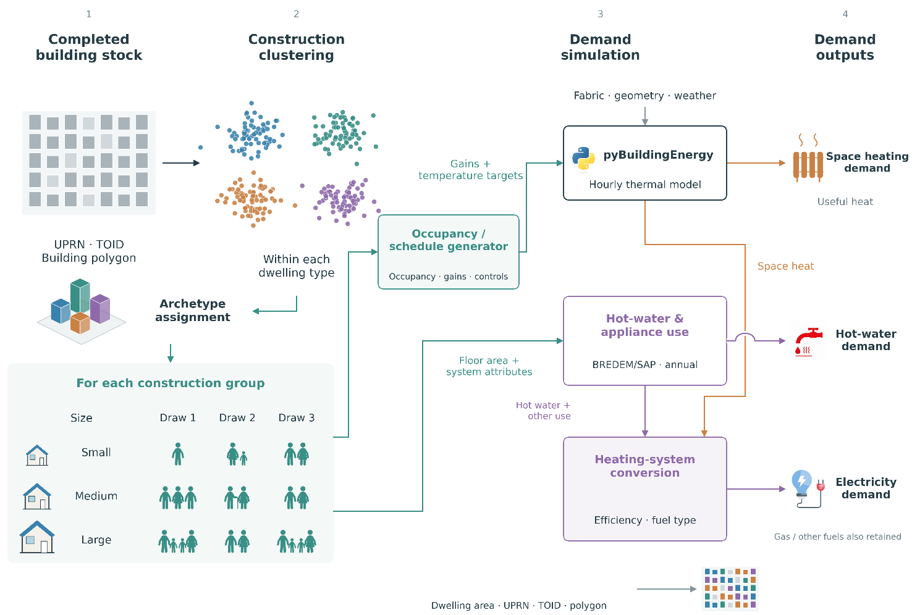
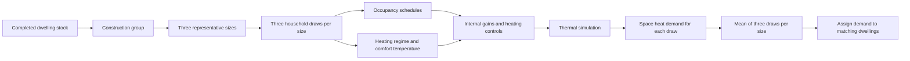

# EnerMap framework for local area energy planning

EnerMap connects completed building stock, construction archetypes and stochastic household schedules to hourly demand simulation and electrification planning. Guildford demonstrates the framework; planning scenarios focus on its dense ten-ward study area.

The current simulation library uses **cluster-median construction properties at three median floor areas**, with three stochastic household draws for each size. Original dwelling records and clustering are preserved. Baseline, retrofit scenarios and the downstream interface have all been rerun consistently; the preceding results remain in Git history.

## From archetypes to demand



For each construction group, the three representative sizes are simulated with three household and behaviour draws each. The household can differ between draws. The model calculates space heat demand for every draw, then averages the three hourly demand profiles for each representative size. Those size-specific profiles are assigned to the matching dwellings.



## Explore

1. Stock preparation and linkage: notebooks/01_stock.
2. Construction archetypes, size representatives and household schedules: model notebooks 00–04 and the clustering diagnostics.
3. Demand, validation and consistency checks: 05, 06_validation, 07_consistency_checks and 09_lsoa_atlas.
4. Electrification, fabric and PV scenarios: 10_ward_scenarios and 12_planning_visuals.
5. The Streamlit app: validation, time profiles, scenario comparisons, electricity peaks and maps from the same current run.

The rooftop-PV notebook remains in notebooks/03_solar. The separate road-proximity experiment remains in notebooks/04_explorations.

## Run the dashboard

Use Python 3.11 or 3.12:

```sh
python -m venv .venv
# Windows PowerShell: .venv/Scripts/Activate.ps1
# macOS/Linux: source .venv/bin/activate
python -m pip install -r requirements.txt
python -m streamlit run app.py
```

The app reads packaged results and does not execute the modelling notebooks. Scenario, area and week controls select saved data. No raw inputs or thermal-engine installation is required to explore the app. A GitHub repository alone is not a hosted Streamlit website.

## Current results

This presents a case study of EnerMap, presented for Guildford Borough Council, which contains 57,300 dwellings (Residential). Results are 567.6 GWh/year useful space heat, 722.9 GWh/year delivered gas, and 246.6 GWh/year delivered electricity. Scenario tables also include the ten-ward subtotal of 28,663 dwellings. Scope is explicit in every view.

Heat-pump electricity comes from hourly heat/COP and is summed annually. Annual BREDEM/SAP usage and normalised hourly profiles provide one consistent electricity/DHW account.


## Notebook guide


| Notebook | Role |
|---|---|
| [00_data_basis.ipynb](notebooks/02_model/00_data_basis.ipynb) | Current modelling workflow |
| [01_archetypes.ipynb](notebooks/02_model/01_archetypes.ipynb) | Current modelling workflow |
| [02_representatives.ipynb](notebooks/02_model/02_representatives.ipynb) | Current modelling workflow |
| [03_engine_setup.ipynb](notebooks/02_model/03_engine_setup.ipynb) | Current modelling workflow |
| [04_household_schedules.ipynb](notebooks/02_model/04_household_schedules.ipynb) | Current modelling workflow |
| [05_archetype_run.ipynb](notebooks/02_model/05_archetype_run.ipynb) | Current modelling workflow |
| [06_validation.ipynb](notebooks/02_model/06_validation.ipynb) | Current modelling workflow |
| [07_consistency_checks.ipynb](notebooks/02_model/07_consistency_checks.ipynb) | Current modelling workflow |
| [09_lsoa_atlas.ipynb](notebooks/02_model/09_lsoa_atlas.ipynb) | Current modelling workflow |
| [10_ward_scenarios.ipynb](notebooks/02_model/10_ward_scenarios.ipynb) | Current modelling workflow |
| [11_pypsa_interface.ipynb](notebooks/02_model/11_pypsa_interface.ipynb) | Internal downstream interface; optional review |
| [12_planning_visuals.ipynb](notebooks/02_model/12_planning_visuals.ipynb) | Current modelling workflow |
| [notebook13_clustering_diagnostics.ipynb](notebooks/02_model/notebook13_clustering_diagnostics.ipynb) | Current modelling workflow |
